<h2>TensorFlow-FlexUNet-Image-Segmentation-MIAS-Mammogram (2025/06/16)</h2>

This is the first experiment of Image Segmentation for MIAS Mammogram (Benign and Malignant) 
 based on 
our <a href="./src/TensorFlowFlexUNet.py">TensorFlowFlexUNet</a>
 (<b>TensorFlow Flexible UNet Image Segmentation Model for Multiclass</b>) and 
<a href="https://drive.google.com/file/d/12ilVRIZR7Q6_BAT2-788lM7eFPb-5aXS/view?usp=sharing">
Augmented-MIAS-PNG-ImageMask-Dataset.zip</a>, which was derived by us from the 
<a href=" https://www.repository.cam.ac.uk/handle/1810/250394">
(2015). Mammographic Image Analysis Society (MIAS) database v1.21 [Dataset].</a>
 
 

<b>Actual Image Segmentation for 512x512 MIAS Dataset</b> 
As shown below, the inferred masks look similar to the ground truth masks.  
In the following predicted mask images, green regions indicate benign areas, while red regions indicate malignant lesions. 

<table>
<tr>
<th>Input: image</th>
<th>Mask (ground_truth)</th>
<th>Prediction: inferred_mask</th>
</tr>
<tr>
<td>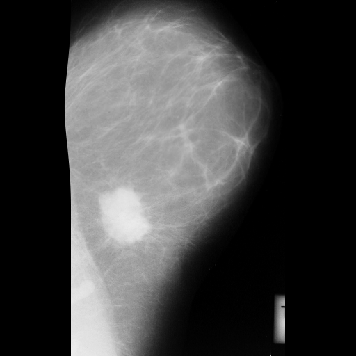</td>
<td></td>
<td></td>
</tr>

<tr>
<td>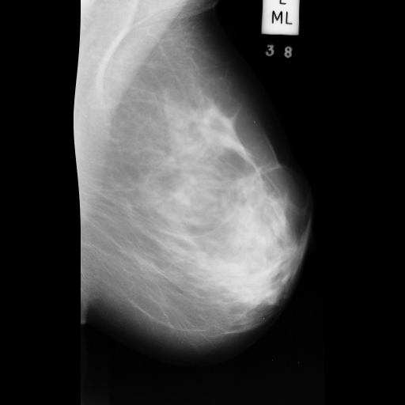</td>
<td></td>
<td></td>
</tr>

<tr>
<td>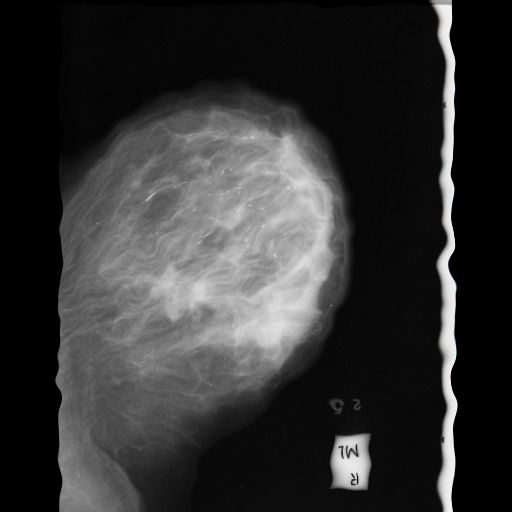</td>
<td></td>
<td></td>
</tr>
</table>

 
 
h3>1 Dataset Citation</b></h3>
MIAS 2015
<b>About Dataset</b> 
<b>Citation</b> 
Suckling, J., Parker, J., Dance, D., Astley, S., Hutt, I., Boggis, C., Ricketts, I., et al.  
(2015). Mammographic Image Analysis Society (MIAS) database v1.21 [Dataset]. 
 https://www.repository.cam.ac.uk/handle/1810/250394 
 
<b>Description</b> 
The Mammographic Image Analysis Society database of digital mammograms (v1.21).  
Contains the original 322 images (161 pairs) at 50 micron resolution in "Portable Gray Map" (PGM) format and associated truth data. 
 
This record will be updated with publication details. 
 
This record is licensed under a CC BY licence.  
<b>Format</b> 
00README.pdf and original article in PDF format Digital mammograms are in PGM format 
Keywords 
Mammography, MIAS, database, digital mammograms 
Sponsorship 
This work was supported by the Mammographic Image Analysis Society with authors contributing their time and facilities  
free-of-charge [grant number RNAG/302]. 

 

 
<h3>
<a id="2">
2 MIAS ImageMask Dataset
</a>
</h3>
 If you would like to train this MIAS Segmentation model by yourself,
 please download the dataset from the google drive  
<a href="https://drive.google.com/file/d/12ilVRIZR7Q6_BAT2-788lM7eFPb-5aXS/view?usp=sharing">
Augmented-MIAS-PNG-ImageMask-Dataset.zip</a>, 
, expand the downloaded ImageMaskDataset and put it under <b>./dataset</b> folder to be
<pre>
./dataset
└─MIAS
    ├─test
    │   ├─images
    │   └─masks
    ├─train
    │   ├─images
    │   └─masks
    └─valid
        ├─images
        └─masks
</pre>
 
 
<b>MIAS Statistics</b> 
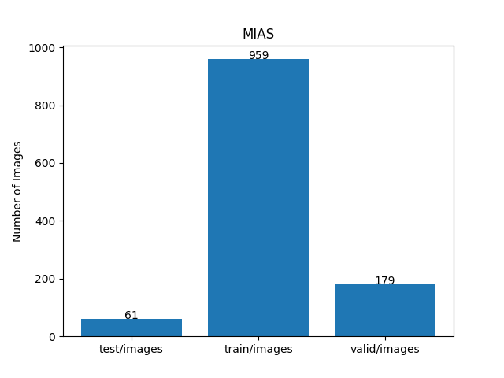 
 
As shown above, the number of images of train and valid datasets is not large enough 
to use for a training set of our segmentation model.
 
 
<!--
On the derivation of this Augmented dataset, please refer to Python script in <a href="./generator/ImageMaskDatasetGenerator.py">
ImageMaskDatasetGenerator.py.</a>. 
 
-->
<b>Train_images_sample</b> 
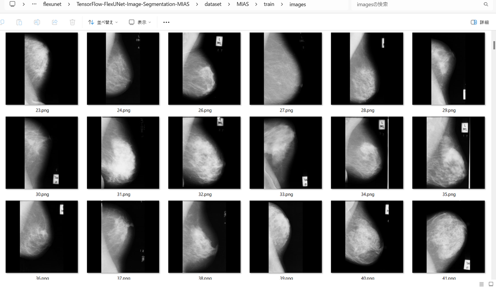
 
<b>Train_masks_sample</b> 
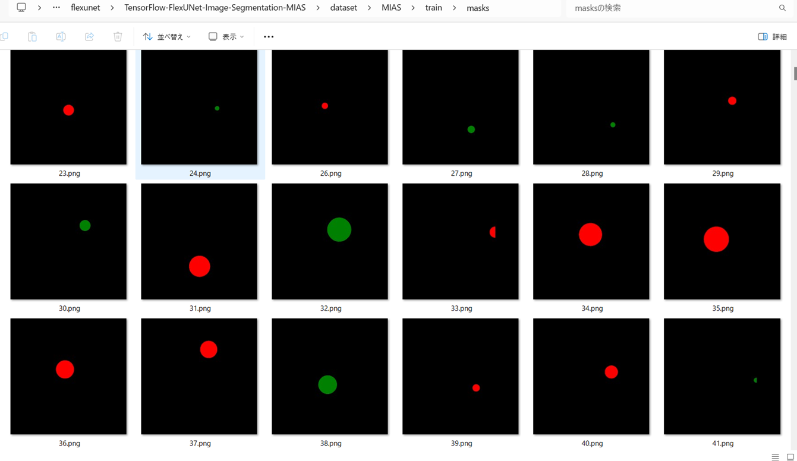
 

<h3>
3 Train TensorFlowFlexUNet Model
</h3>
 We trained MIAS TensorFlowFlexUNet Model by using the following
<a href="./projects/TensorFlowFlexUNet/MIAS/train_eval_infer.config"> <b>train_eval_infer.config</b></a> file.  
Please move to ./projects/TensorFlowFlexUNet/MIAS and run the following bat file. 
<pre>
>1.train.bat
</pre>
, which simply runs the following command. 
<pre>
>python ../../../src/TensorFlowFlexUNetTrainer.py ./train_eval_infer.config
</pre>

<b>Model parameters</b> 
Defined a small <b>base_filters = 16 </b> and slightly large <b>base_kernels = (5,5)</b> for the first Conv Layer of Encoder Block of 
<a href="./src/TensorFlowFlexUNet.py">TensorFlowFlexUNet.py</a> 
and a large num_layers (including a bridge between Encoder and Decoder Blocks).
<pre>
[model]
;You may specify your own UNet class derived from our TensorFlowFlexModel
model         = "TensorFlowFlexUNet"
generator     =  False
image_width    = 512
image_height   = 512
image_channels = 3
num_classes    = 3

base_filters   = 16
base_kernels   = (5,5)
num_layers     = 8
dropout_rate   = 0.04
dilation       = (2,2)
</pre>
<b>Learning rate</b> 
Defined a very small learning rate.  
<pre>
[model]
learning_rate  = 0.00007
</pre>
<b>Loss and metrics functions</b> 
Specified "categorical_crossentropy" and <a href="./src/dice_coef_multiclass.py">"dice_coef_multiclass"</a>. 
<pre>
[model]
loss           = "categorical_crossentropy"
metrics        = ["dice_coef_multiclass"]
</pre>
<b>Dataset class</b> 
Specifed <a href="./src/ImageCategorizedMaskDataset.py">ImageCategorizedMaskDataset</a> class. 
<pre>
[dataset]
class_name    = "ImageCategorizedMaskDataset"
</pre>
 
<b>Learning rate reducer callback</b> 
Enabled learing_rate_reducer callback, and a small reducer_patience.
<pre> 
[train]
learning_rate_reducer = True
reducer_factor     = 0.4
reducer_patience   = 4
</pre>
<b>Early stopping callback</b> 
Enabled early stopping callback with patience parameter.
<pre>
[train]
patience      = 10
</pre>

<b>RGB Color map</b> 
<pre>
[mask]
mask_datatyoe    = "categorized"
mask_file_format = ".png"
;MIAS rgb color map dict for 1+2 classes.
;    Background:black, Benign:green,  Malignant:red
rgb_map = {(0,0,0):0,(0, 255, 0):1, (255, 0, 0):2, }

</pre>

<b>Epoch change inference callback</b> 
Enabled <a href="./src/EpochChangeInferencer.py">epoch_change_infer callback</a></b>. 
<pre>
[train]
epoch_change_infer       = True
epoch_change_infer_dir   =  "./epoch_change_infer"
num_infer_images         = 6
</pre>

By using this callback, on every epoch_change, the inference procedure can be called
 for 6 images in <b>mini_test</b> folder. This will help you confirm how the predicted mask changes 
 at each epoch during your training process.  
As shown below, early in the model training, the predicted masks from our UNet segmentation model showed 
discouraging results.
 However, as training progressed through the epochs, the predictions gradually improved.   
<b>Epoch_change_inference output at starting (epoch 1,2,3)</b> 
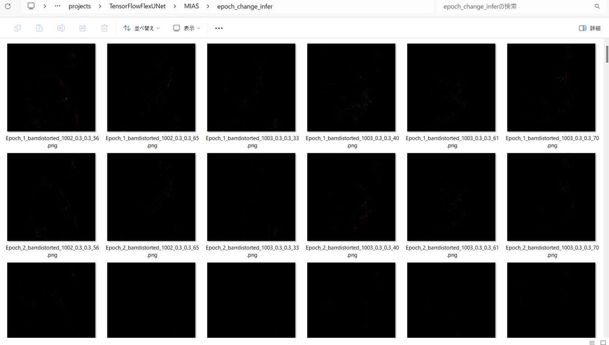 
 

<b>Epoch_change_inference output at middlepoint (epoch 20,21,22)</b> 
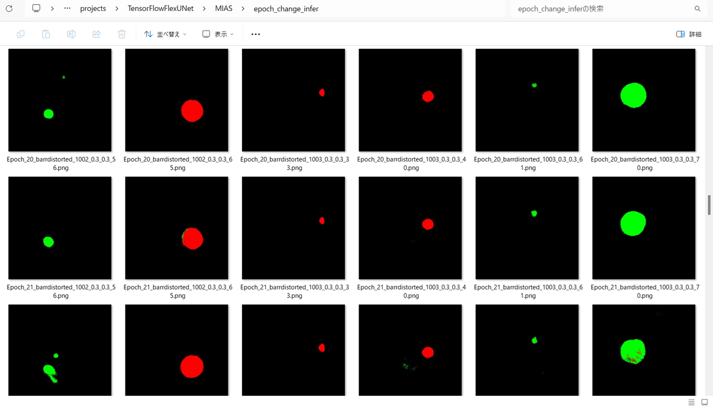 
 
<b>Epoch_change_inference output at ending (epoch 43,44,45)</b> 
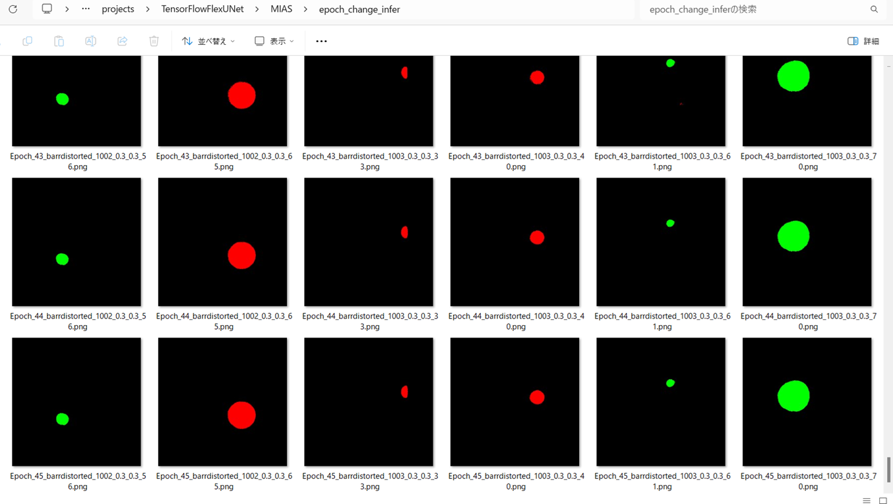 
 

In this experiment, the training process was stopped at epoch 45 by EarlyStopping callback.  
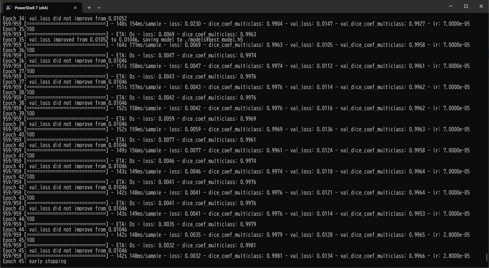 
 
<a href="./projects/TensorFlowFlexUNet/MIAS/eval/train_metrics.csv">train_metrics.csv</a> 
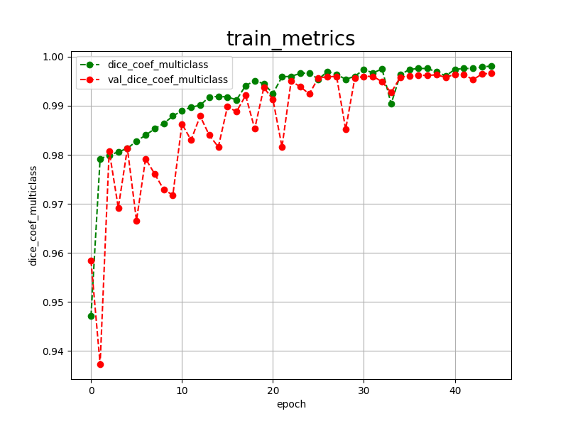 
 
<a href="./projects/TensorFlowFlexUNet/MIAS/eval/train_losses.csv">train_losses.csv</a> 
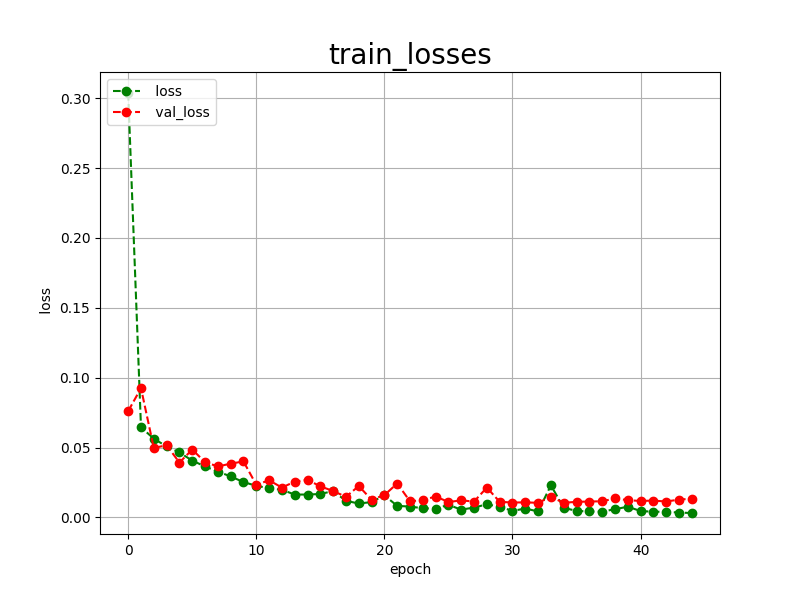 
 
<h3>
4 Evaluation
</h3>
Please move to <b>./projects/TensorFlowFlexUNet/MIAS</b> folder, 
and run the following bat file to evaluate TensorFlowUNet model for MIAS. 
<pre>
./2.evaluate.bat
</pre>
This bat file simply runs the following command.
<pre>
python ../../../src/TensorFlowFlexUNetEvaluator.py ./train_eval_infer_aug.config
</pre>

Evaluation console output: 
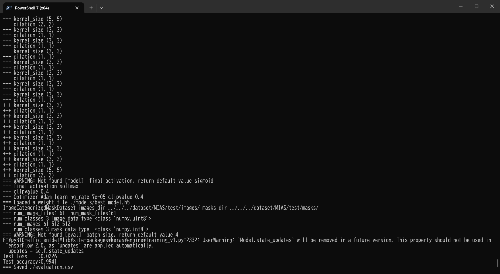
  Image-Segmentation-MIAS

<a href="./projects/TensorFlowFlexUNet/MIAS/evaluation.csv">evaluation.csv</a> 
The loss (categorical_crossentropy) to this MIAS/test was low and dice_coef_multiclass 
was very high as shown below.
 
<pre>
categorical_crossentropy,0.0226
dice_coef_multiclass,0.9941
</pre>
 

<h3>
5 Inference
</h3>
Please move to a <b>./projects/TensorFlowFlexUNet/MIAS</b> folder 
,and run the following bat file to infer segmentation regions for images by the Trained-TensorFlowUNet model for MIAS. 
<pre>
./3.infer.bat
</pre>
This simply runs the following command.
<pre>
python ../../../src/TensorFlowFlexUNetInferencer.py ./train_eval_infer_aug.config
</pre>

<b>mini_test_images</b> 
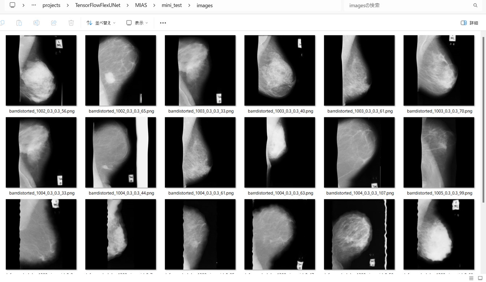 
<b>mini_test_mask(ground_truth)</b> 
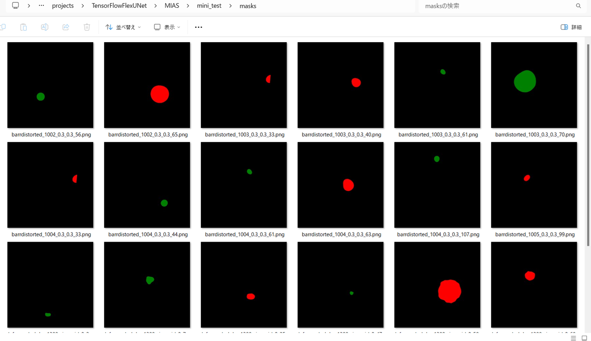 

<b>Inferred test masks</b> 
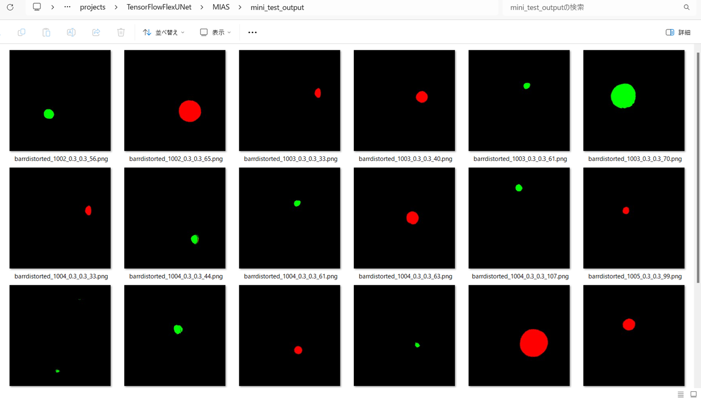 
 

<b>Enlarged images and masks of 512x512 pixels</b> 

<table>
<tr>
<th>Image</th>
<th>Mask (ground_truth)</th>
<th>Inferred-mask</th>
</tr>

<tr>
<td>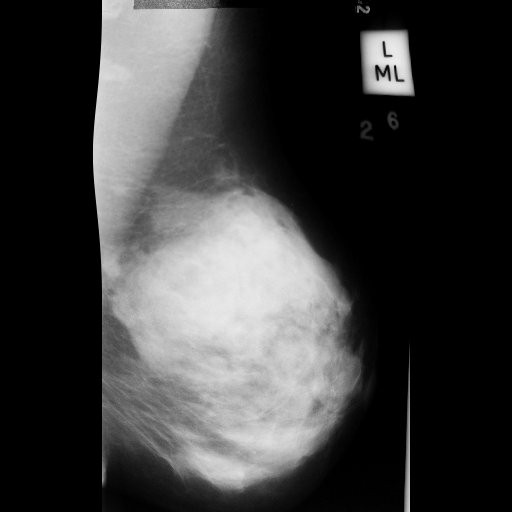</td>
<td>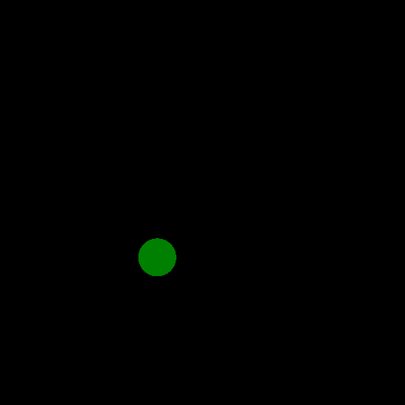</td>
<td></td>
</tr>

<tr>
<td></td>
<td></td>
<td></td>
</tr>

<tr>
<td></td>
<td></td>
<td></td>
</tr>

<tr>
<td></td>
<td></td>
<td></td>
</tr>

<tr>
<td>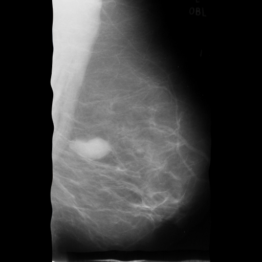</td>
<td>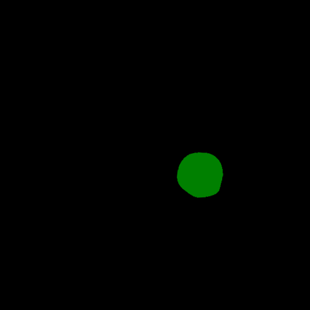</td>
<td></td>
</tr>

<tr>
<td>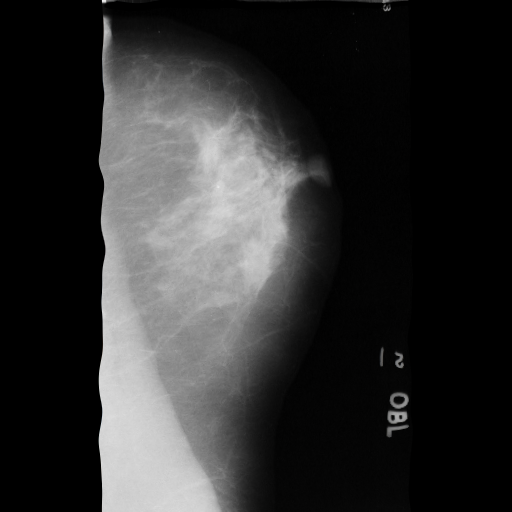</td>
<td></td>
<td></td>
</tr>
</table>

 

<h3>
References
</h3>
<b>1. Mammographic Image Analysis Society (MIAS) database v1.21</b> 
<a href="https://www.repository.cam.ac.uk/items/b6a97f0c-3b9b-40ad-8f18-3d121eef1459">https://www.repository.cam.ac.uk/items/b6a97f0c-3b9b-40ad-8f18-3d121eef1459</a> 
 
 
<b>2. Efficient breast cancer mammograms diagnosis using three deep neural networks and term variance</b> 
Ahmed S Elkorany, Zeinab F Elsharkawy
 
<a href="https://pmc.ncbi.nlm.nih.gov/articles/PMC9932150/">https://pmc.ncbi.nlm.nih.gov/articles/PMC9932150/</a>
 
 
<b>3. A review of the machine learning datasets in mammography,  
their adherence to the FAIR principles and the outlook for the future</b> 
Joe Logan, Paul J. Kennedy & Daniel Catchpoole  
<a href="https://www.nature.com/articles/s41597-023-02430-6">https://www.nature.com/articles/s41597-023-02430-6</a>
 
 
<b>4. Tensorlfow-Image-Segmentation-MIAS-Mammogram  
Toshiyuki Arai @antillia.com 
<a href="https://github.com/sarah-antillia/Tensorlfow-Image-Segmentation-MIAS-Mammogram">
https://github.com/sarah-antillia/Tensorlfow-Image-Segmentation-MIAS-Mammogram
</a>

